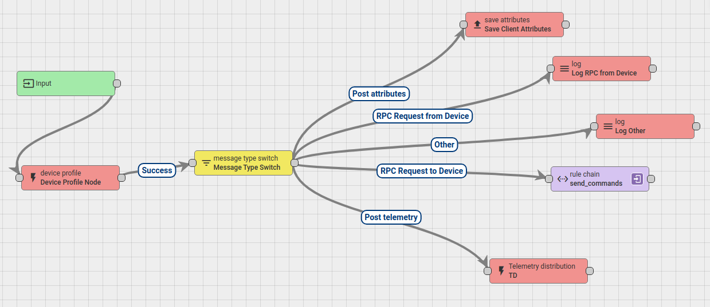

# ThingsBoard Rule Node

This project provides the TelemetryDistribution rule node for the ThingsBoard rule chain of the SmartSens project.

## Installation

* Import it as an IntelliJ project and run `mvn install`

* Or use the following :
    ```bash
    mvn install
    ```

* If __ΝΟΤ__ running from docker run the following :
    ```bash
    sudo cp rule-engine-1.0.0-custom-nodes.jar /usr/share/thingsboard/extensions/
    sudo chown thingsboard:thingsboard /usr/share/thingsboard/extensions/*
    sudo service thingsboard restart
    ```
* If running ThingsBoard from Docker :
    1. Copy the `rule-engine-1.0.0-custom-nodes.jar` inside a folder itself on the host.
    2. Create a volume from this folder and mount it inside the container.
    3. Restart the container.

## Usage
You have to have the following relation types between your products and your assets :

```
Storage Asset - Contains -> Food Asset
Storage Asset - Contains -> Device 
```

Use the rule nude as following : 


